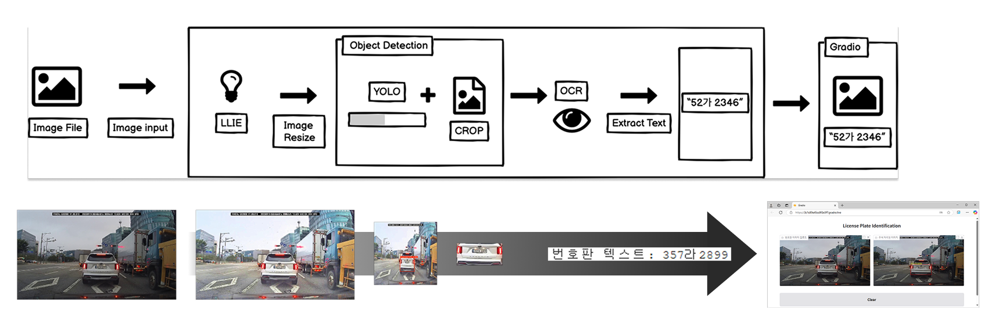

# 📸 블랙박스 이미지 번호판 인식 시스템

## 📌 Summary

-   🎯 Automatically detect and recognize license plates from user-submitted dashcam images.
-   🤔 **Why** this project exists
    -   🚧 Many traffic violation reports in Korea’s Safety Report Portal(안전신문고) are rejected due to unreadable license plates in dashcam footage.
    -   🌙 Dashcam images often suffer from low-light, low-resolution, or motion blur.
    -   📣 A robust recognition system is needed to help users submit valid reports more easily.
-   🚀 **How** we solved it
    -   🛠️ Unified pipeline that enhances low-light images, detects object(license plates), and extracts text using OCR.
    -   🖼️ Provide a final output image with the recognized plate number overlaid as a caption.

## 👀 How does it work?

## ⚙️ Pipeline

  
  
  
  
  
  
  

